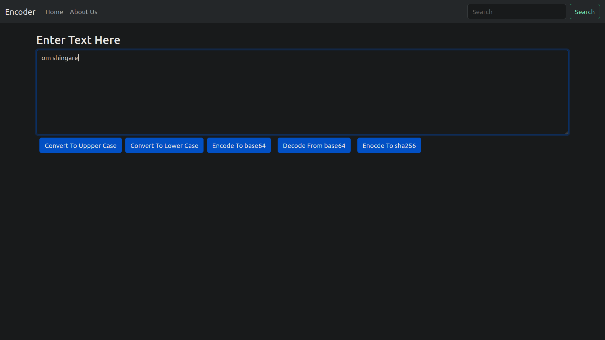
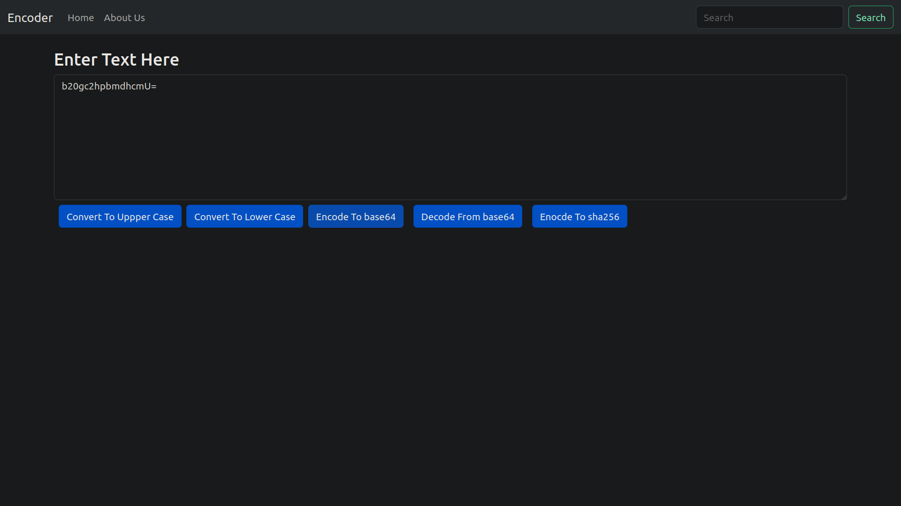

# Encoder Using Reactjs

---

---
A simple ReactJS project that allows users to encode and decode text using various encoding formats, including **Uppercase**, **Lowercase**, **SHA256**, and **Base64**. The application also demonstrates the use of React hooks (`useState`) and basic event handling.

## Features
- **Text Encoding Options**: 
  - Uppercase
  - Lowercase
  - SHA256
  - Base64 encoding and decoding
- **Responsive UI** built with **Bootstrap**
- **State Management** with React's `useState` hook
- **Event Handling** in ReactJS

## Project Overview

This project demonstrates how to handle state in React using the `useState` hook and how to manage user input with event handling. The application allows users to input text, select an encoding option, and see the encoded or decoded result in real time.

## Technologies Used
- **ReactJS**: JavaScript library for building user interfaces.
- **Bootstrap**: CSS framework for building responsive, mobile-first websites.
- **CryptoJS**: A JavaScript library for cryptographic algorithms (used for SHA256 encoding).
- **Base64 Encoding/Decoding**: Used for encoding/decoding data in Base64 format.

## Demo

You can try out the live demo of the project [here](#).

## Getting Started

To get started with this project locally, follow these instructions:

### Prerequisites

Ensure you have the following installed on your machine:
- [Node.js](https://nodejs.org/)
- [npm](https://www.npmjs.com/) (comes with Node.js)

### Installation

1. Clone the repository to your local machine:

   ```bash
   git clone https://github.com/ShingareOm/Encoder.git
   cd Encoder
   ```

2. Install the required dependencies:

   ```bash
   npm install
   ```

3. Start the development server:

   ```bash
   npm start
   ```

   This will start the application and open it in your default browser at `http://localhost:3000`.

## Usage

1. Open the application in your browser.
2. Type the text you want to encode or decode in the input box.
3. Choose one of the encoding options:
   - **Uppercase**: Converts the text to uppercase letters.
   - **Lowercase**: Converts the text to lowercase letters.
   - **SHA256**: Applies SHA256 hashing to the text.
   - **Base64 Encode**: Encodes the text into Base64 format.
   - **Base64 Decode**: Decodes the Base64 encoded text.
4. The result will be displayed below the input field.

## Code Overview

### `App.js`
The main component of the application. It contains:
- **State management** using `useState` to store the input text and the result.
- **Event handling** for the buttons that trigger encoding/decoding.
- Conditional rendering to display results based on the selected encoding method.

### `TextForms.js`
Utility functions for encoding and decoding:
- **toUppercase**: Converts the input text to uppercase.
- **toLowercase**: Converts the input text to lowercase.
- **toSHA256**: Hashes the input text using the SHA256 algorithm (via CryptoJS).
- **toBase64**: Encodes the input text to Base64.
- **fromBase64**: Decodes the Base64 encoded text back to the original format.

## Future Enhancements
- Add more encoding algorithms (e.g., MD5, Hex encoding).
- Improve UI/UX with better design and features.
- Add unit tests for utility functions.

## License

This project is licensed under the MIT License - see the [LICENSE](LICENSE) file for details.
